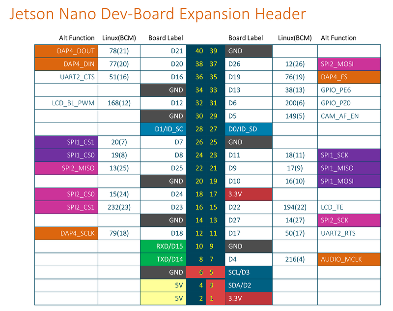

# BOSCH-BMI160-ROS-Library

Copyright (c) 2020 Bosch Sensortec GmbH. All rights reserved.

BSD-3-Clause

This is a ROS Package of "BMI160 6 DOF IMU C++ driver". 

### To use in an another package:

1. Clone this repo into src folder
2. cd ~/catkin_ws/
3. catkin_make
4. source devel/setup.bash

5. Add CMakeLists.txt of the "other" package:
```
find_package(catkin REQUIRED COMPONENTS
  roscpp
  ...
  imu_bmi160
)
```

6. Add package.xml of the "other" package:
```
  <build_depend>imu_bmi160</build_depend>
```

7. Copy bmi160_acc_example.cpp to the "other" package's /src folder, compile and run as an executable.

```
add_executable(bmi160_acc_example src/bmi160_acc_example.cpp)
target_link_libraries(bmi160_acc_example 
${catkin_LIBRARIES} 
)
```

8. This will print out acceleration values only:
```
rosrun other_package bmi160_acc_example
```

## Warning!

BMI160 is sharing I2C port with PCA9685 as a slave. In the original code, address is 0x68. Since BMI160 is a slave now, line 590 in bmi160_defs.h had been changed to:

```
/* BMI160 I2C address */
#define BMI160_I2C_ADDR                      UINT8_C(0x69)
```

The address to be written above can be found by the command:
```
i2cdetect -y -r 1
```
which returns:
```
     0  1  2  3  4  5  6  7  8  9  a  b  c  d  e  f
00:          -- -- -- -- -- -- -- -- -- -- -- -- -- 
10: -- -- -- -- -- -- -- -- -- -- -- -- -- -- -- -- 
20: -- -- -- -- -- -- -- -- -- -- -- -- -- -- -- -- 
30: -- -- -- -- -- -- -- -- -- -- -- -- -- -- -- -- 
40: 40 -- -- -- -- -- -- -- -- -- -- -- -- -- -- -- 
50: -- -- -- -- -- -- -- -- -- -- -- -- -- -- -- -- 
60: -- -- -- -- -- -- -- -- -- 69 -- -- -- -- -- -- 
70: 70 -- -- -- -- -- -- --   
```

## I2C Connection

Jetson Nano I2C pins used showed with red, 1,3,5,6.
